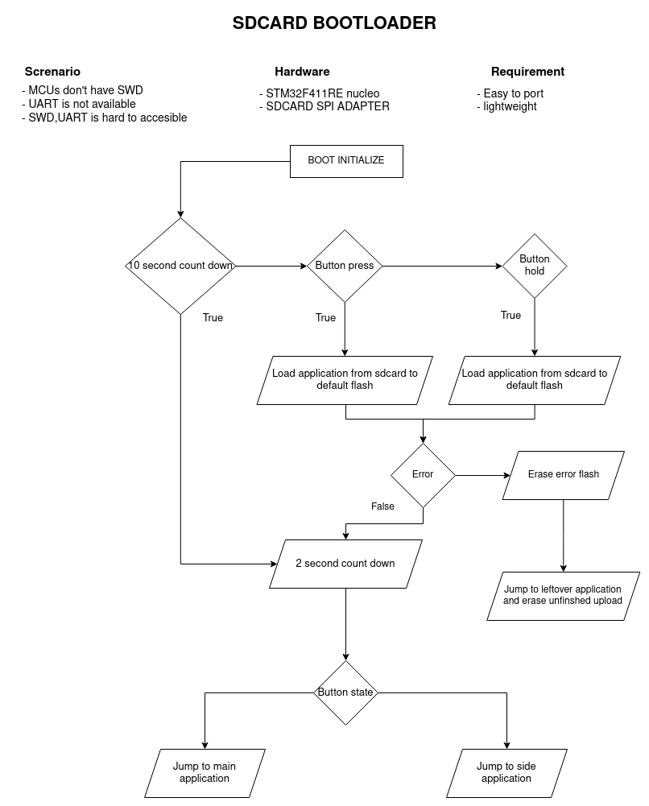

# STM32 SDCARD Bootloader
The purpose of this project is to reduces  hardware uploading program time by using SDCARD. As in linux devkit, they often use SDCARD or MMC memory to storage image for booting.
## Specification
- Arm-gcc
- STM32F411RE Nucleo Board
	- 512kb FLASH - 8 sectors
- Micro SDCard SPI Adapter Module 
- SPI2
- USART2
- Systick
- Bootloader is ~14Kb with ```-Os``` optimazation without logging
## Flash sector
| Address | Sector | Program |
| :---:  | :---: | :---: |
| 0x0800 0000 | Sector 0 | Bootloader |
| 0x0800 4000 | Sector 1 | Bootloader |
| 0x0800 8000 | Sector 2 | Bootloader |
| 0x0800 C000 | Sector 3 | Side app |
| 0x0801 0000 | Sector 4 | Side app |
| 0x0802 0000 | Sector 5 | Side app |
| 0x0804 0000 | Sector 6 | Main app |
| 0x0806 0000 | Sector 7 | Main app |

Bootloader program will be placed in 48Kb section, Side app is in 208 Kb section and Main app is in 256Kb section 

### **Side App is the secondary application for backup purpose if Main app is fail**
## How do i use it ?
The project is written by STM32CubeIDE, so its recommended to use STM32CubeIDE.

---
- Complete ```port.c``` to match your hardware
- Modify ```ll_serial.c``` to use your desired usart device
- Modify ```ll_flash.c``` to match your flash requirement
- Modify ```ll_spi.c```  to match your spi to sdcard device
- Build and upload to your hardware

If you wish to change the address of bootloader please modify MEMORY section in ```./STM32F411RETX_FLASH.ld``` and change ```VECT_TAB_OFFSET``` in ```./Core/Src/system_stm32f4xx.c```

## Application for bootloader
In ```Example``` folder contains example for main app and side. If you wish to modify application address, follow above steps.
## Bootloader Behavior


## Uploader programs
The example of uploader is in ```script``` folder.

Run ```python3 ./script/uploader.py -h``` for more information
## Contribute
Feel free to help my project.

